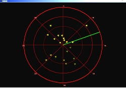



## Radar Simulation

### Description

This is a simple radar simulation. The radar sweeps around in a circle looking for aircraft using the 'Dot Product'. Once it finds the aircraft it remembers it's location and plots it on the scope. The aircrafts last known location will then gradually fade until the next time it gets hit. If you swing the radar too fast you will miss an aircraft (just like a real radar unit).

This radar demo was inspired by the following two submissions:

1)

Title: Air Traffic Control Simulator

Author: seyi Ogunbanjo

http://www.planet-source-code.com/vb/scripts/ShowCode.asp?txtCodeId=66211&amp;lngWId=1

2)

Title: A Radar Screen

Author: Kenneth Foster

http://www.planet-source-code.com/vb/scripts/ShowCode.asp?txtCodeId=66278&amp;lngWId=1
 
### More Info
 

             |
---                |---
**Submitted On**   |2006-08-18 20:53:12
**By**             |[Peter Wilson](https://github.com/Planet-Source-Code/PSCIndex/blob/master/ByAuthor/peter-wilson.md)
**Level**          |Intermediate
**User Rating**    |5.0 (55 globes from 11 users)
**Compatibility**  |VB 6\.0
**Category**       |[Graphics](https://github.com/Planet-Source-Code/PSCIndex/blob/master/ByCategory/graphics__1-46.md)
**World**          |[Visual Basic](https://github.com/Planet-Source-Code/PSCIndex/blob/master/ByWorld/visual-basic.md)
**Archive File**   |[Radar\_Simu2014238182006\.zip](https://github.com/Planet-Source-Code/peter-wilson-radar-simulation__1-66307/archive/master.zip)

